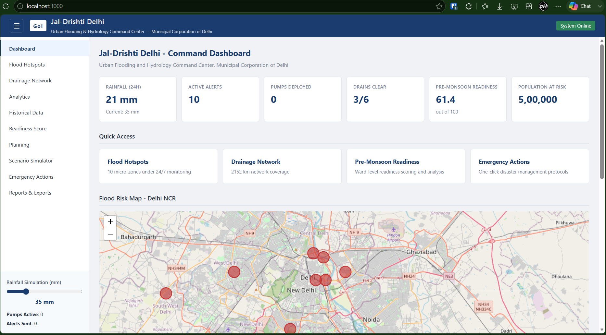
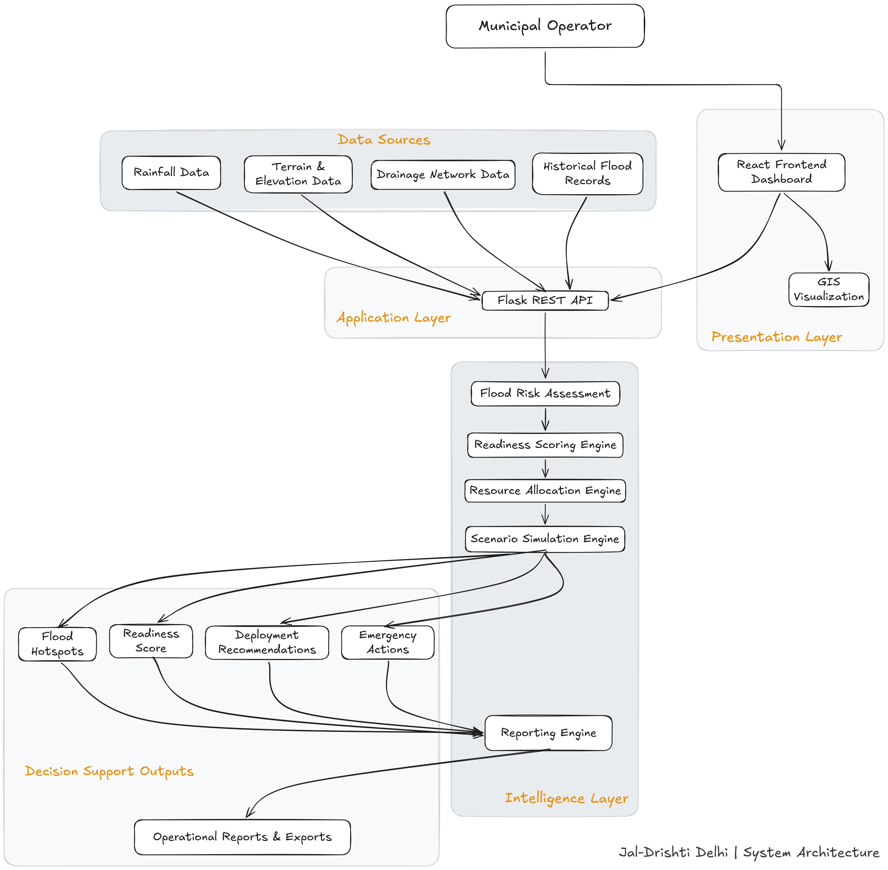

<p align="center">
  
</p>

<h1 align="center">
  Jal-Drishti Delhi
</h1>

<p align="center">
  <strong>Urban Flood Intelligence & Decision Support Platform</strong><br>
  <em>Delhi NCR Pilot Implementation</em>
</p>

<p align="center">
  <a href="https://jal-drishti-delhi-mu.vercel.app/">Live Demo</a> •
  <a href="ARCHITECTURE.md">Architecture Documentation</a>
</p>

---

## Problem Statement

> Urban Flooding & Hydrology Engine: Develop a GIS-integrated predictive system to identify urban flood micro-hotspots using historical rainfall data, terrain elevation, and drainage capacity, while generating ward-level preparedness indicators to support proactive resource deployment before heavy rainfall events.

---

## Project History

Jal-Drishti Delhi originated from an Urban Flooding & Hydrology challenge focused on improving flood preparedness and decision-making for Indian cities.

The project has since evolved into a broader Urban Flood Intelligence and Decision Support Platform that combines flood monitoring, GIS visualization, readiness assessment, resource planning, scenario simulation, emergency response workflows, and operational reporting into a unified municipal command center.

**Original Challenge Reference:**
*Urban Flooding & Hydrology Engine - Municipal Corporation of Delhi*

[View Original Problem Statement and Source](https://unstop.com/conferences/india-innovates-2026-municipal-corporation-of-delhi-1625920)

---

## About



Jal-Drishti Delhi is an **Urban Flood Intelligence and Decision Support Platform** designed to help municipal authorities monitor flood risks, assess preparedness, prioritize interventions, and coordinate emergency response operations.

The platform integrates flood hotspot monitoring, GIS-based visualization, drainage analysis, readiness scoring, resource allocation planning, scenario simulation, and reporting into a single operational dashboard.

While the current implementation focuses on Delhi NCR as a pilot region, the architecture is designed to support future deployment across multiple cities and urban flood management environments.

---

## System Architecture



The platform follows a layered architecture comprising Data Sources, Application Services, Intelligence Engines, and Decision Support modules. For detailed architecture, component descriptions, data flow, and API references, see [ARCHITECTURE.md](ARCHITECTURE.md).

---

## Features

### Flood Monitoring

* Real-time flood risk assessment across identified hotspots
* GIS-based hotspot visualization using OpenStreetMap and Leaflet
* Dynamic rainfall simulation
* Risk trend tracking and historical analysis
* Drainage network monitoring

### Predictive Analytics

* Water-level prediction
* Rainfall correlation analysis
* Zone-wise risk distribution
* Historical flood trend analysis

### Pre-Monsoon Readiness Score

* Ward-level readiness scoring
* Multi-factor preparedness assessment
* Readiness grading system
* Rainfall-sensitive readiness simulation

### Resource Allocation Engine

* Resource inventory tracking
* Priority-zone identification
* Resource deployment recommendations
* Impact estimation and planning support

### Flood Scenario Simulator

* What-if flood simulations
* Multiple rainfall and stress scenarios
* Baseline vs simulated comparisons
* Resource requirement estimation
* Recommended response actions

### Emergency Operations

* Pump deployment workflows
* Traffic diversion actions
* Resident alerting support
* Situation reporting
* Audit logging

### Reports & Exports

* Flood situation reports
* Resource allocation reports
* Scenario analysis reports
* CSV exports for operational datasets

---

## Technology Stack

### Backend

* Python 3.8+
* Flask
* Flask-CORS
* NumPy
* Pandas

### Frontend

* React 18
* React Router
* Recharts
* Leaflet
* React-Leaflet
* Axios

### Other

* OpenStreetMap
* Custom CSS
* No external database
* No paid APIs

---

## Application Modules

* Dashboard
* Flood Hotspots
* Drainage Network
* Analytics
* Historical Data
* Readiness Score
* Planning
* Scenario Simulator
* Emergency Actions
* Reports & Exports

---

## To run the application on your local host, follow this:

### Backend

```bash
cd backend
pip install -r requirements.txt
python app.py
```

### Frontend

```bash
cd frontend
npm install
npm start
```

### Quick Start (Windows)

```text
start_fullstack.bat
```

---

## Future Scope

The current platform serves as a pilot implementation for Delhi NCR. Future enhancements may include:

* **Advanced flood-risk prediction models**
* Multi-city deployment support
* **Automated alert and notification systems**
* Integration with real-time weather and sensor feeds
* Geospatial analytics using PostGIS
* Resource optimization and emergency response automation
* Citizen-facing awareness and reporting modules

---

## Design Decisions

### Why Flask?

The backend mainly serves computed data and simulation logic, so Flask keeps the project lightweight and easy to understand.

### Why React?

The application behaves like an operational dashboard and benefits from a client-side SPA architecture.

### Why No Database?

The current version uses static seed datasets and in-memory state. For a production deployment, PostgreSQL and PostGIS would be natural additions.

### Why a Government-Style UI?

The target users are municipal operators and emergency response teams. The focus is on clarity, information density, and usability rather than visual effects.

---
---

Built by **Ayush Hardeniya**

[E-Mail](mailto:ayushhardeniya@hotmail.com?subject=Jal-Drishti%20Delhi%20-%20Project%20Inquiry) •
[GitHub](https://github.com/ayushHardeniya) •
[X](https://x.com/ayushHardeniya)
